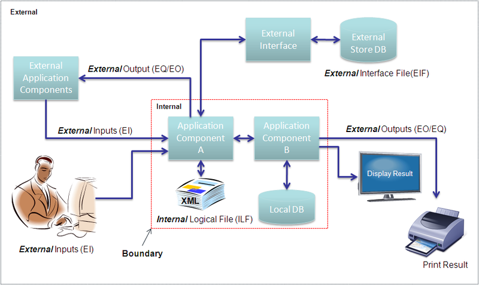

# learning 
## UMSP, Impacted Function Point(IFPUG-FPA/NESMA) & SNAP 

### 1. UMSP (Unit of software measurement parameterization)

- [SDLC Evolution](https://www.simplilearn.com/project-management-life-cycles-evolution-article)
- [SQA](https://www.tutorialspoint.com/software_quality_management/index.htm)
- [Estimating Types](https://project-management.info/estimating-activity-durations/#2-how-is-activity-duration%0Aestimated)
- [Parametric Estimating](https://project-management.info/parametric-estimating/)
- [Estimation Techniques](https://www.tutorialspoint.com/estimation_techniques/estimation_techniques_quick_guide.htm)
- [Sizing methods](https://nesma.org/themes/sizing/) - Why determine the size of my software product?
- [Software Size measures - 1](https://nesma.org/2015/05/software-size-measures-and-their-use-in-software-project-cost-estimation/) - use in software project estimation 
- [Software Size measures - 2](https://nesma.org/2015/07/software-size-measures-and-their-use-in-software-project-estimation-part-2/)-- use in software project estimation 
- [Esimation Benchmarks](https://www.isbsg.org/resources-estimation/)

### 2.1 Impacted Function Point [IFPUG FPA](https://ifpug.org/ifpug-standards/fpa)

- Software size estimation and complexity analysis
- Overview of Function Point Analysis 
- User View ( Functional requirements and Non Functional requirements ) 
- Determine Type of Count 
- Identify Counting Scope and Application Boundary
- Count Data Functions 

           - ILF (Internal Logical file)
           - EIF (External Interface Files)
           - Identifying RETs, DETs
           - Rate Complexity - RETs,DETs

- Count Transactional Functions 

           - EI (External Inputs)
           - EQ (External Inquiries)
           - EO (External Outputs)
           - Identifying  FTRS, DETs
           - Rate Complexity - DETs, FTRs

- Determine Value Adjustment Factor (VAF) - GSC (Global system Charaterstics)

- Calculate Adjusted Function Point Count 

            - Development Project
            - Enhancement project
            - Application Project 

- [IFPUG reference](https://ifpug.mclms.net/en/)
- [Improve Your Sizing](https://www.isbsg.org/resources-sizing/)
- [FPA Calculator - 1](https://w3.cs.jmu.edu/bernstdh/web/common/webapps/oop/fpcalculator/FunctionPointCalculator.html)
- [IFPUG Tips](https://ifpug.org/ifpug-standards/fpa)
- [FPA-Flow](https://people.cs.ksu.edu/~padmaja/Project/CostEstimate)

### 2.2. [NESMA](https://nesma.org/freedocs/nesma-on-sizing-function-point-analysis/0)

Areas where measurement and metrics can help .Many areas in the IT industry benefit from metrics. On her website Nesma offers information about software measurement, software metrics and the way they could be and should be applied in practice. 

[Nesma Guidelines](https://nesma.org/themes/)

The information is structured in six themes:

- [Benchmarking of software projects](https://nesma.org/themes/benchmarking/) - Do I get value for money? 
- [Outsourcing of software projects/contracts](https://nesma.org/themes/outsourcing/) - Guidelines for RFP’s
- [Productivity measurement and management](https://nesma.org/themes/productivity/challenges-productivity-meaurement/) - Why should I measure productivity? 
- [Project Control](https://nesma.org/themes/project-control/) - Do you have control over a project?
- [Estimating cost in software projects](https://nesma.org/themes/estimating/) - Which steps do I need to follow to estimate a budget for a project based on FPA?
- [Nesma Enhancement Impact Factor](http://www.functionpointmodeler.com/fpm-infocenter/index.jsp?topic=%2Fcom.functionpointmodeler.fpm.help%2Fditafiles%2Fconcepts%2Fcon-120.html)
- [Software Size Estimation tool](http://softwarecost.org/tools/COCOMO/)
- [Agile Estimation](https://www.isbsg.org/resources-agile/)
 
### 3. [SNAP](https://ifpug.org/ifpug-standards/snap) & NFR(Non Functional Requirements) 
- [SNAP Tips](https://ifpug.org/ifpug-standards/snap#itips)
